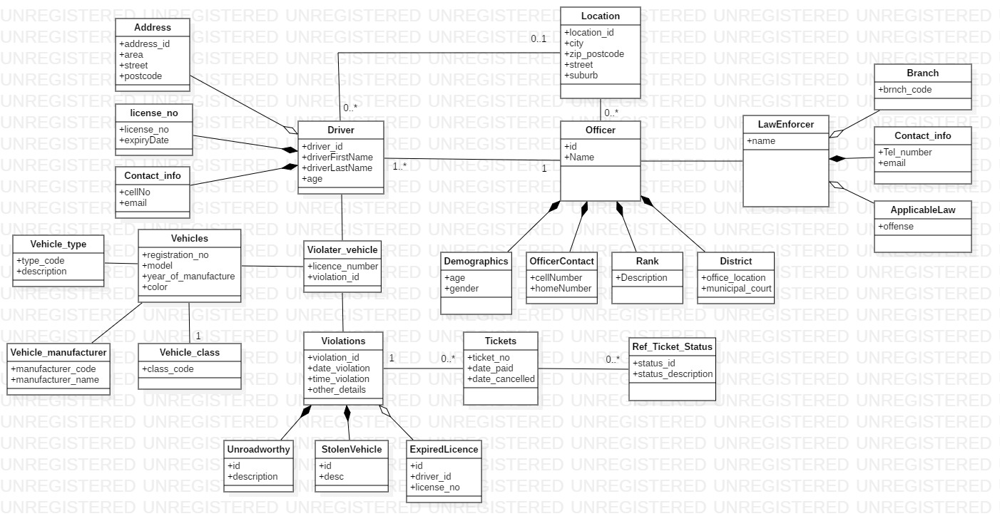

# Narrative of application:

## Domain selected: Transport

Problem specification:
To ensure unroadworthy vehicles are not operating illegally. 
The application to be developed will allow the user to check the status of the vehicle and whether the license number matches the correct vehicle. 
This will also ensure hijack or stolen vehicles are detected immediately. 

Every vehicle should be registered so the department can monitor unroadworthy vehicles on the road. 

###Target market:
*All* law enforcement departments that deals with traffic by-laws and crime can use this application. 
The program will include the following functionality:

- Checks whether the vehicle has the correct license number.
- Add description if car is unroadworthy.
- Checks if the drivers license is expired.
- Searches driver information

